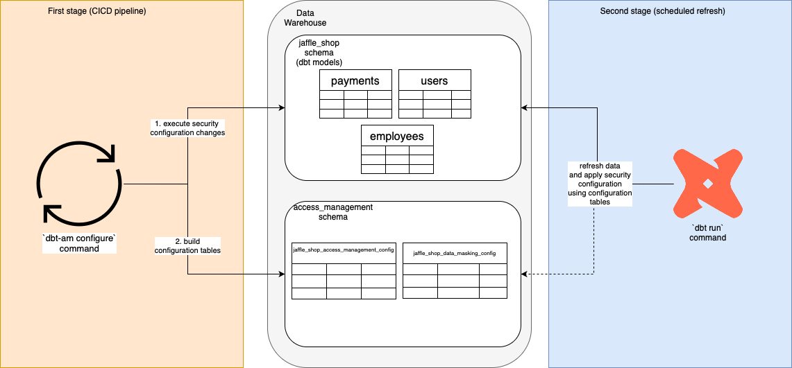

# DBT Access Management

`dbt-access-management` is a tool designed to manage access control and data masking in your dbt projects.  
Currently, it supports **AWS Redshift**.

## Table of Contents

1. [Overview](#overview)  
2. [Installation](#installation)  
3. [Configuration](#configuration)  
4. [Usage](#usage)  
5. [Engineering Backlog](#engineering-backlog)  
6. [Known Caveats](#known-caveats)   

---

## Overview

`dbt-access-management` operates in two stages:  

1. **Configuration and Validation using `dbt-am configure` command**  
   This stage validates the desired security configurations, applies security changes and builds configuration tables under the `access_management` schema.
   It is intended for use in CI/CD pipelines but can also be utilized by data administrators for ad-hoc security changes.

2. **Applying Security Policies in dbt post-hooks**  
   This stage runs dbt macros in post-hooks to maintain the desired security state after dbt models are executed.  
   It reads the configuration tables created in the first stage to apply grants and data masking policies.

### Sample Diagram



---

## Installation

The tool is designed to be user-friendly, requiring only Python and dbt as prerequisites.  
Always install the library using the latest tag. You can find all available tags [here](https://github.com/adam-staros95/dbt-access-management/tags).

### CLI Installation

To install the CLI, execute the following command:

```bash
pip install git+https://github.com/adam-staros95/dbt-access-management.git@<tag>

```

### DBT Macros Installation 

To install DBT macros, add the following package to the `packages.yml` file:

```yaml
packages:
  - git: https://github.com/adam-staros95/dbt-access-management.git
    revision: <tag>
```
And execute the `dbt deps` command.

---

## Configuration

To configure the tool in your project go through following steps:

### Update `dbt_project.yml` file 
```yaml
models:
  jaffle_shop:
     +post-hook:
      - {{ dbt_access_management.execute_grants_for_model() }}
      - {{ dbt_access_management.apply_masking_policies_for_model() }}
seeds:
  jaffle_shop:
     +post-hook:
      - {{ dbt_access_management.execute_grants_for_model() }}
      - {{ dbt_access_management.apply_masking_policies_for_model() }}
```

If you don't want to configure database privileges, you can skip adding the `execute_grants_for_model` macro. 
Similarly, if you don't want to configure data masking, you can skip adding the `apply_masking_policies_for_model` macro.

### Create `access_management.yml` file

This file defines the access levels for different users, roles, and groups across your dbt models.
If your project supports multiple environments or databases, you can list them all in a single configuration file.
By default, file should be created in the same directory as your dbt_project.yml file. 

You can skip this step if you don't want to configure database privileges.
#### Sample file

```yaml
databases:
  jaffle_shop_dev:
    users:
      tom:
        +access_level: read
        staging:
          +access_level: write
          hr:
            employees:
              access_level: read_write
          finance:
            +access_level: read_write
    groups:
      legal:
        +access_level: read_write
  jaffle_shop_test:
    users:
      jane:
        staging:
          hr:
            payroll:
              +access_level: read
    roles:
      marketing:
        +access_level: read
  jaffle_shop_prod:
    roles:
      admins:
        +access_level: all
```

Notes:
- `jaffle_shop_dev`, `jaffle_shop_test` and `jaffle_shop_prod` are databases where dbt models are created.
- Entity names under the `users`, `roles`, and `groups` sections are case-sensitive.

Supported access levels:
- `read`
- `write`
- `read_write`
- `all`

### Create `data_masking.yml` file

This file contains dynamic data masking policies configurations of your dbt models.
By default, file should be created in the same directory as your dbt_project.yml file.

You can skip this step if you don't want to configure data masking..
#### Sample file

```yaml
configuration:
  - employees:
      columns:
        - first_name:
            roles_with_access:
              - hr_role
              - oauth_aad:HR_TEAM
        - last_name:
            roles_with_access:
              - hr_role
              - oauth_aad:HR_TEAM
  - clients:
      columns:
        - email:
            roles_with_access:
              - marketing
            users_with_access:
               - jane
               - tom
```
Notes:
- `employees` and `clients` are dbt_models.
- Entity names under `roles_with_access` and `users_with_access` are case-sensitive.
- Only configured entities can access unmasked data.
---

## Usage

Once `dbt-access-management` is configured, you are ready to configure security in your dbt project.

Run the following command from your dbt project directory:
```bash
dbt-am configure --dbt-command "<your_dbt_command>"
```

For example:
```bash
dbt-am configure --dbt-command "dbt run"
```

This command:

1. Runs `dbt compile` to retrieve a list of your dbt models.
2. Executes the `dbt run-operation` command to apply security configurations.
3. Creates data masking policies and configuration tables used in post-hooks.

`dbt-am configure` supports following options:

- `--configure-access-management` - set to `False` to disable privilege configuration (e.g., for data masking only).
- `--configure-data-masking` - set to `False` to disable data masking configuration (e.g., for privileges only).
- `--access-management-config-file-path` - specify a custom location for the `access_management.yml` file.
Can be used to configure database privileges in multiple files depending on environment.
- `--data-masking-config-file-path` - specify a custom location for the `data_masking.yml` file.
Can be used to configure data masking differently depending on environment.
- `--database-name` - by default information about database name will be read from `manifest.json` file after project compilation. However,
if your project uses models defined in other projects and in different databases than your project, 
you need provide database name in which you want to create your models explicitly.    

---

## Engineering backlog
- Add support for column-level security.
- Add support for row-level security.
- Format code using tool like `SQLFluff` 
- Implement a `--dryrun` option to display the SQL commands to be executed without actually running them.
- Implement a `--skip-compile` option to bypass the `dbt compile` step during the `dbt-am configure` command.
- Enhance the tool to read database system tables to maintain privilege configurations, ensuring consistency and avoiding external changes.
- Rename the `access_management.yml` file to privileges.yml and update corresponding configuration table names.

---

## Known caveats

### Serializable isolation violation
In concurrent environments running `dbt-am configure` command during a `dbt run` in different process may result in following error:
```text
ERROR:1023 DETAIL: Serializable isolation violation on a table in Redshift.
```

**Solution:**
you can update your database isolation level to snapshot:
```sql
ALTER DATABASE <db_name> ISOLATION LEVEL SNAPSHOT;
```

